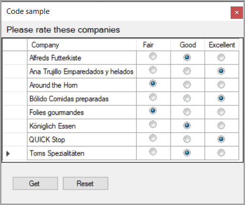

# DataGridView setup for surveys

Shows how to use a DataGridView to provide an interface for asking questions using mocked radio buttons along with validation that the user made a selection for each row.

The data source for the DataGridView is a DataTable as there is less work involved than using a **BindingList&lt;T>** with a class setup for change notification.

## Framework

.NET Framework 4.8

## Original aricle

Written for Microsoft TechNet Wiki which has been retired but a half decent version can be [found here](https://learn.microsoft.com/en-us/archive/technet-wiki/52170.datagridview-setup-for-surveys).